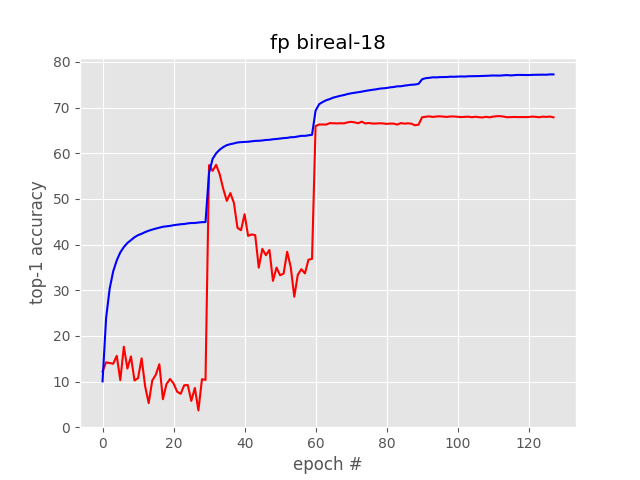
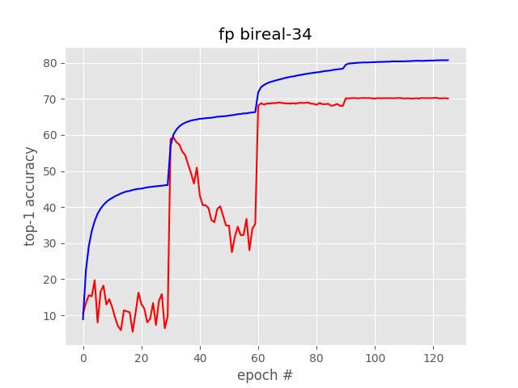

# BiRealNet
Implementation of Bi-Real-Net Model in Pytorch https://arxiv.org/abs/1808.00278 

Below you can find pretrained weights on imagenet for full-precision bireal18 and bireal34 network.

Both networks are trained by setting initial `lr=1.0e-1`, `weight_decay=1e-4` and `momentum=0.9`. The learning rate is decayed by 0.1 using a step-lr schedule every 30 epochs for a total of 120 epochs. 

 

- [Bireal-18](http://bit.ly/bireal18)
- [Bireal-34](http://bit.ly/bireal34)

### Related Work

BNN+: Improved Binary Network Training: https://arxiv.org/abs/1812.11800
